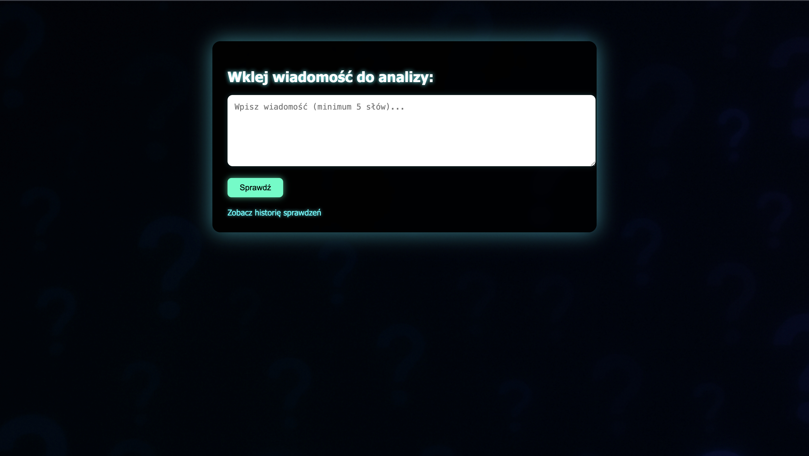

# 📰 Fake News Detector

Aplikacja webowa w Pythonie wykorzystująca model uczenia maszynowego do klasyfikowania wiadomości jako **Fake** lub **True**.

## 🧰 Technologie

- Python + Flask  
- scikit-learn, pandas, nltk  
- HTML/CSS (Flask templates)  
- SQLite (logowanie wyników)  
- Bootstrap (UI)

## 🚀 Uruchomienie lokalne

### 1. Stwórz środowisko

```bash
python -m venv venv
source venv/bin/activate      # lub .\venv\Scripts\activate na Windows

## 📸 Zrzut ekranu aplikacji

